---

# Full-Stack Kubernetes Learning Environment

[](https://opensource.org/licenses/MIT)

This project provides a complete, containerized, and orchestrated full-stack application designed to serve as a hands-on learning tool for Kubernetes. It deploys a React frontend, two Spring Boot microservices, and a replicated PostgreSQL database, all running together within a Minikube cluster.

The primary goal is to demonstrate and explain core Kubernetes concepts by seeing them in action in a real-world (though simplified) architecture, moving from local code to a fully running orchestrated system.

## Table of Contents
- [Architecture Diagram](#architecture-diagram)
- [Technology Stack](#technology-stack)
- [Features](#features)
- [Prerequisites](#prerequisites)
- [Getting Started](#getting-started)
- [Kubernetes Concepts in Action](#kubernetes-concepts-in-action)
- [Project Structure](#project-structure)
- [Cleanup](#cleanup)
- [License](#license)

## Architecture Diagram

The application follows a standard microservice architecture. All traffic is routed through a single Ingress entry point, which directs requests to the appropriate service based on the URL path.



## Technology Stack
*   **Frontend:** React.js
*   **Backend:** Java 21, Spring Boot 3
*   **Database:** PostgreSQL
*   **Containerization:** Docker
*   **Orchestration:** Kubernetes (via Minikube)
*   **Gateway:** Nginx Ingress Controller

## Features
- **Microservice Architecture:** Decoupled write and read services.
- **High Availability:** Demonstrates scaling with multiple replicas for the read service.
- **Data Persistence:** Uses `StatefulSet` and `PersistentVolume` for the database.
- **Centralized Configuration:** Employs `ConfigMap` and `Secret` for managing configuration and credentials.
- **Automated Deployment:** A single `deploy.sh` script to build, deploy, and configure the entire stack.
- **Runtime Environment Injection:** A production-ready pattern for injecting configuration into a static React frontend.

## Prerequisites

Before you begin, ensure you have the following tools installed and configured:
- **Minikube:** For running a local Kubernetes cluster.
- **Docker:** To build the container images.
- **kubectl:** The Kubernetes command-line tool.
- **Java Development Kit (JDK):** Version 17 or higher.
- **Git:** For cloning the repository.
- A shell environment (like Bash on Linux/macOS or Git Bash on Windows).

## Getting Started

Follow these steps to get the entire environment up and running from scratch.

### 1. Clone the Repository
```sh
git clone <your-repository-url>
cd kubernetes-learning
```

### 2. Start Your Minikube Cluster
This command starts a fresh cluster. The `--driver=docker` flag is recommended for best performance on most systems.
```sh
minikube start --driver=docker
```

### 3. Enable the Minikube Ingress Addon
The Ingress controller acts as the "front door" to our application, managing all incoming traffic. It must be enabled once per cluster.
```sh
minikube addons enable ingress
```

### 4. Run the Master Deployment Script
This script automates the entire process:
- Cleans any previous deployments.
- Creates Kubernetes Secrets for database credentials.
- Builds the Docker images for all three services *inside* Minikube's Docker daemon.
- Deploys all Kubernetes resources (`Deployments`, `Services`, etc.) from the `k8s/` directory.
- Waits for all pods to be in a "Ready" state.
- Automatically updates your local `hosts` file to map `kubernetes.local` to your Minikube IP.

**Note:** The script will likely ask for your administrator/sudo password to modify the `hosts` file.

```sh
chmod +x deploy-minikube.sh
./deploy-minikube.sh
```

### 5. Access the Application
Once the script completes successfully, open your web browser and navigate to:

➡️ **http://kubernetes.local**

## Kubernetes Concepts in Action

This project is a living example of several core Kubernetes concepts. Explore the files in the `k8s/` directory to see how they are implemented:
- **`Deployment`:** Used for our stateless `frontend` and microservices. It ensures self-healing and allows for easy scaling.
- **`StatefulSet`:** Used for our PostgreSQL database to provide stable network IDs and persistent storage.
- **`Service`:** Provides stable internal DNS names for service-to-service communication (e.g., `service1` talking to `postgres-primary-service`).
- **`Ingress`:** Manages all external traffic, routing requests to the correct service based on the URL path.
- **`PersistentVolume` & `PersistentVolumeClaim`:** Provides persistent storage for the database, ensuring data survives pod restarts.
- **`Secret` & `ConfigMap`:** Decouples sensitive data (credentials) and non-sensitive configuration (init scripts) from the application containers.

## Project Structure
```
.
|- deploy-minikube.sh
|- kuberneteslearning-frontendservice
|- README.md
|- images
|- kuberneteslearning-service-1
|- kuberneteslearning-service-2
|- k8s
|   |--- deployments
|   |      |--- frontend-deployment.yaml
|   |      |--- service1-deployment.yaml
|   |      |--- service2-deployment.yaml
|
|   |--- services
|   |      |--- frontend-service.yaml
|   |      |--- primary-service.yaml
|   |      |--- service1-service.yaml
|   |      |--- service2-service.yaml
|   |      |--- replica-service.yaml
|
|   |--- statefulsets
|   |      |--- primary-statefulset.yaml
|   |      |--- replica-statefulset.yaml
|
|   |--- storage
|   |      |--- primary-pv.yaml
|   |      |--- primary-pvc.yaml
|   |      |--- replica-pv.yaml
|   |      |--- replica-pvc.yaml
|
|   |--- configmaps
|   |      |--- primary-init-script-cm.yaml
|
|   |--- networking
|   |      |--- ingress.yaml

```

## Cleanup

To stop and delete all the Kubernetes resources created by this project, you can run the `deploy.sh` script's cleaning step or do it manually.

```sh
# This command will delete all resources in the default namespace
kubectl delete all --all
```

To completely delete the Minikube cluster itself:
```sh
minikube delete
```

## License

This project is licensed under the MIT License. See the [LICENSE](LICENSE) file for details.

---
